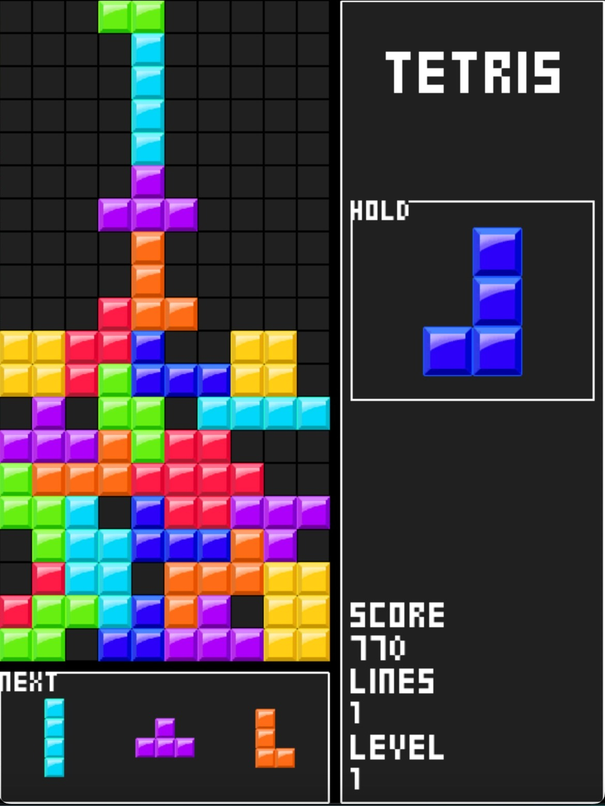

# Tetris Game 🎮



## Project Description 💬
This is a Tetris game implemented in Python using the Pygame library.

## System Requirements ‼️
- Python 3.x
- Pygame

## Installation 🚧
1. Clone or download the repository.
2. Ensure you have Python 3.x installed.
3. Install dependencies by running the following command in your terminal:

```bash
pip install -r requirements.txt
```
## How to Start 🏁

Run the main script:

```bash
python main.py
```

## Controls 👾
* ⬅️ and ➡️ arrow keys to move the pieces.
* ⬆️ arrow key to rotate clock-wise.
* ⬇️ arrow key to rotate soft-drop.
* **Z** or **Left-Cntrl** to rotate anti-clock-wise.
* **Spacebar** to hard-drop
* **C** o **Shift** to hold a piece.
* **R** to restart the game when is over.

# Credits ✍️
This project was developed by Kataplan.

**requirements.txt:**

pygame==2.5.2


To install the dependencies, place the `requirements.txt` file in your project directory and then run the following command:

```bash
pip install -r requirements.txt